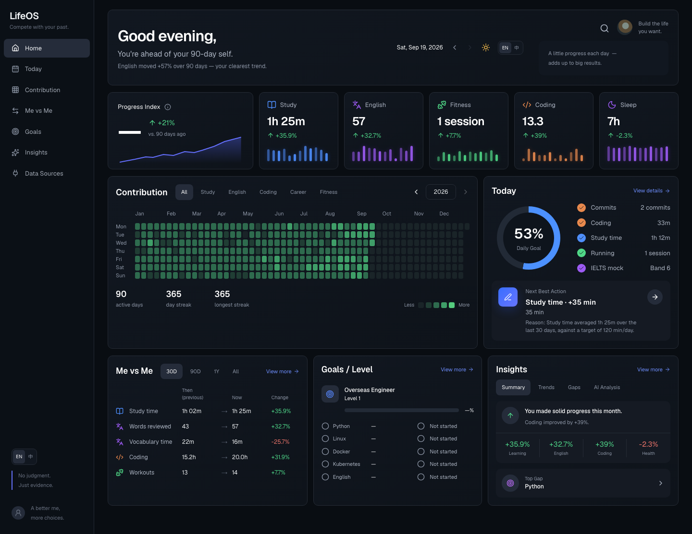
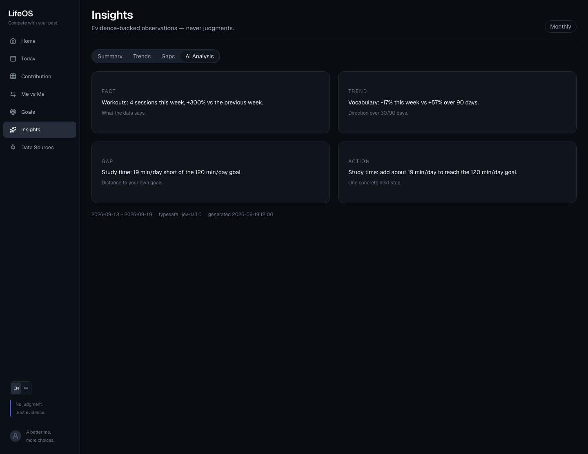

# LifeOS

[English](README.md) · [简体中文](README.zh-CN.md)

> **Compete with your past. Benchmark against the world.**
> 和过去的自己竞争，用世界作为坐标。
>
> **No judgment. Just evidence.**
> 不评价，只提供证据。

[](https://tantantan-lab.github.io/LifeOS/)
[](https://tantantan-lab.github.io/LifeOS/)

LifeOS 是一个个人生活数据仪表盘，**无感知地记录你**——连接一次官方应用（微信读书、墨墨、滴答、训记、GitHub），学习、英语、健身、编程、睡眠的数据就自己流动进来。无需打卡、无需手动记录。它把这条证据流汇聚起来，回答三个问题：

1. **我做了什么？** —— 贡献热力图（365 天，强度按当天值计）
2. **我变了多少？** —— 今昔对比（30 天 / 90 天 / 1 年 / 最初）
3. **下一步去哪？** —— 目标差距 → 下一步行动（带计时器的决策闭环）

## 在线演示

**→ [tantantan-lab.github.io/LifeOS](https://tantantan-lab.github.io/LifeOS/)**（中英文、明暗主题）

公开演示站运行在**写死的确定性 mock 数据快照**上——无数据库、无后端——侧栏标注 "Demo data · not real"。你的真实数据永不出本机。

| 首页 — 热力图、活动卡片、目标环 | AI 分析 — TypeSafe 选择的洞察，中英双语 |
|---|---|
|  |  |

## 核心亮点

- **无感知记录**：连接一次，数据自动流动——读书、背单词、任务、训练、提交全部从官方接口被动同步。无需打卡、无需手动输入
- **365 天热力图**：强度 = 目标完成率，100% 封顶；周目标格子测当天本身（休息日就是空格）
- **五大域一条事件流**：学习 / 英语 / 编程 / 健康 / 效率，官方接口（微信读书、墨墨、滴答、训记、GitHub）自动汇聚，计时器是唯一需要动手的环节
- **洞察是「选择」出来的，不是「生成」的**：代码用你的数字渲染候选句，TypeSafe 的 Jev 模型每题选一句——数字不可能被编造，评判性词汇不可能出现，中英双语
- **目标与就绪度**：只和自己比（海外工程师基准），绝无百分位排名
- **隐私默认**：单用户、数据库只绑本机、密钥只在服务端

## 技术栈

Next.js 16（TypeScript、Tailwind v4）· FastAPI · 纯 PostgreSQL（单 Docker 容器，sub2api 式）· TypeSafe（Jev）· headless-Chrome CDP UI 测试套件

## 快速开始

**容器模式（一条命令）：**

```bash
npm run up          # 构建并启动 web + api + db 全套 Docker（http://localhost:3000）
npm run seed        # 首次：种子用户 + 365 天历史（幂等）
```

**开发模式（热更新，数据库仍在容器内）：**

```bash
npm install
npm run db:up       # 启动 postgres 容器
npm run db:migrate  # 应用 schema
npm run seed        # 种子用户 + 历史
npm run dev         # 热更新开发服务器
```

**常用脚本**

```bash
npm run sync            # 全量同步所有连接器（凭证在 apps/api/.env）
npm run insights        # 生成周洞察（需要 TYPESAFE_API_KEY）
npm run test:api        # API 测试（fixture 驱动，无需 token）
npm run typecheck       # tsc --noEmit
npm run db:reset        # 清库重建 + 迁移 + 重新种子（破坏性）
```

## Docker 部署

生产形态是全栈三容器（web + api + db），sub2api 式单机部署：

```bash
npm run up          # docker compose up -d --build — web (standalone) + api + postgres:17
```

- `apps/web/Dockerfile` — 多阶段构建：装依赖 → 编译 → 只运行 standalone runner（`.next/standalone` + 静态资源）；构建前自动清理 `.next`，防增量缓存毒化镜像
- `apps/api/Dockerfile` — FastAPI 连接器引擎（定时同步 + TypeSafe 洞察），绑定 127.0.0.1:8000
- 数据 bind-mount 在 `.data/postgres`；所有端口只绑本机；密钥只在 `apps/api/.env`（gitignored）

公开演示站走的是另一条路：静态导出 + 确定性 mock 数据上 GitHub Pages，见 [docs/demo-deploy.md](docs/demo-deploy.md)。

## 目录结构

```
compose.yaml        开发数据库 — 单个 postgres:17 容器，127.0.0.1:5432，
                    数据 bind-mount 在 .data/postgres（sub2api 式）
apps/web            Next.js 16 + TypeScript + Tailwind v4
apps/web/scripts    migrate.ts + seed.ts + CDP UI 套件 + 静态 demo 辅助脚本
apps/api            FastAPI — 连接器引擎 + TypeSafe 洞察
database/migrations PostgreSQL DDL
docs                架构 / 设计系统 / 数据模型 / demo 部署
```

## 里程碑

- **M1（完成）**：UI — 首页、贡献、今昔对比、目标 + 设计系统。
- **M2（完成）**：数据库 — 单 Postgres 容器：users/events/goals/metrics/data_sources，365 天种子历史，读路径切到 DB。
- **M3（完成）**：五域 taxonomy、连接器引擎（GitHub + 微信读书 + 墨墨 + 滴答 — 官方 API）、洞察管线（analytics 摘要 → TypeSafe Choice (Jev) → FACT/TREND/GAP/ACTION）、真实"今天"。
- **M4（完成）**：交互补齐 — 下一步行动（附理由）、热力图日详情、仪表盘头部、每日目标环、数据源页。
- **M5（完成）**：决策界面 — NBA 主卡（开始计时 → 手动记录 → 循环重推导）；等级徽章 + 技能状态；洞察四标签页；主题切换。
- **M6（下一步）**：财务 / 营养域、健康页、更多连接器。
